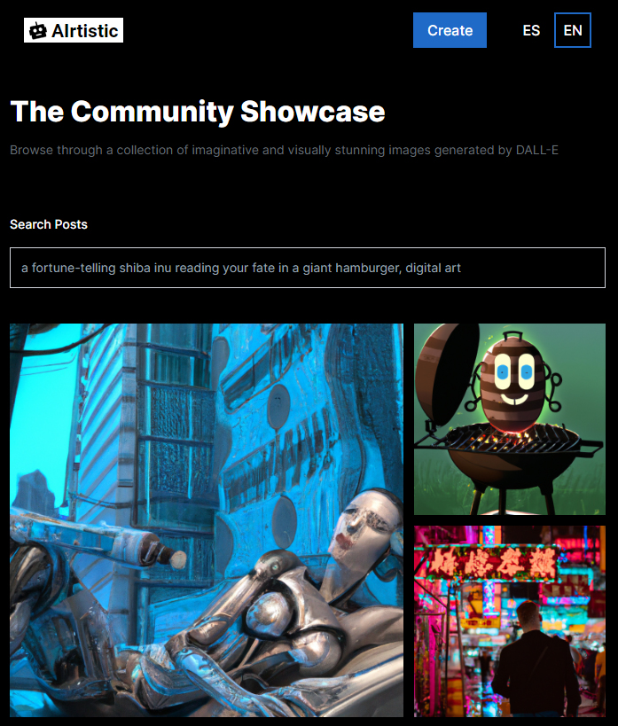

# AIrtistic

This is the first project that I make with React. I'm fascinated with the current state of AI enviroment so I decided to create an app where you can generate images with the [openAI](https://openai.com/) API of DALL-E.

## Table of Contents

* [General Info](#general-information)
* [Technologies Used](#technologies-used)
* [Features](#features)
* [Screenshots](#screenshots)
* [Contact](#contact)

## General Information

- App created mainly with React 
- User can generate images using prompts.
- Backend Database with MongoDB and Cloudinary

## Technologies Used

- HTML5 - Tailwind CSS - Javascript - React - Node JS - Express 

## Features

- Fully responsive
- Images generated by DALL-E
- Users can share their creations with others

## Screenshots

 
 

## Contact

Created by [Adrian Kervin](https://www.linkedin.com/in/kervinmarquinez/) - feel free to contact! 
Credits to [Adrian Hajdin - JS Mastery](https://github.com/adrianhajdin) for being an inspiration and guide me with this project. Subscribe to his [Youtube channel!](https://www.youtube.com/@javascriptmastery)